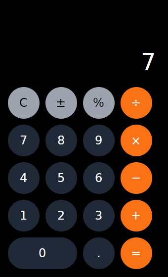
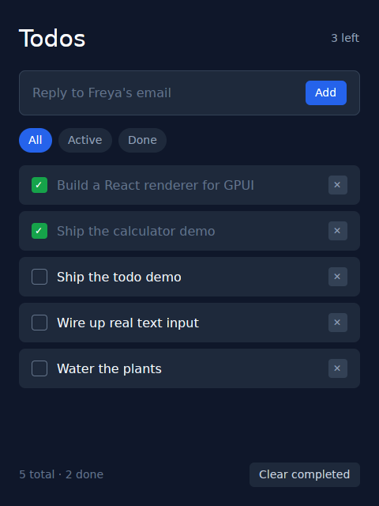
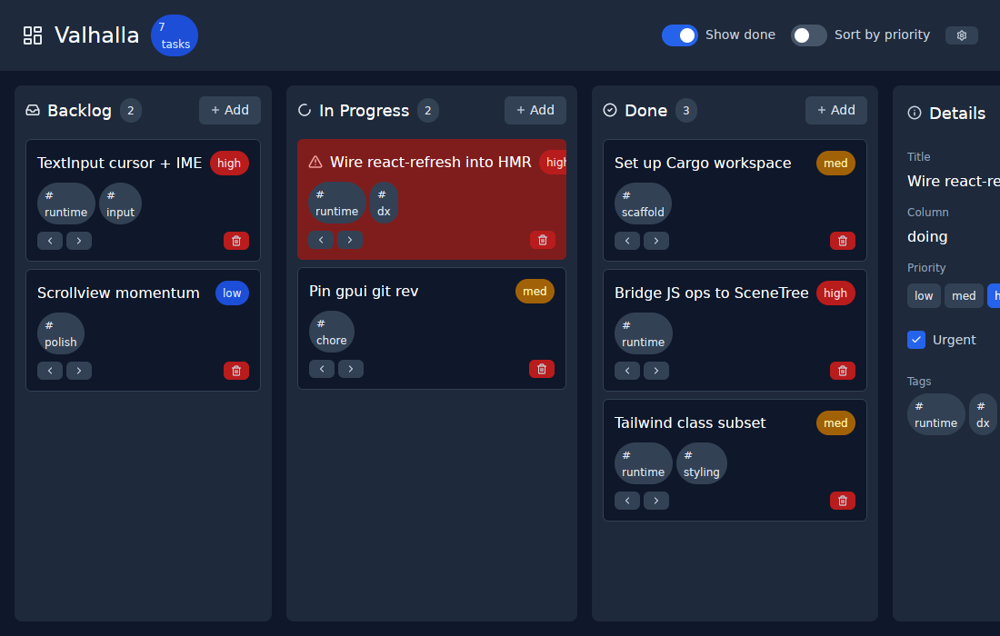

# Valhalla

> React for the desktop. Native pixels via GPUI, JavaScript via QuickJS, Tailwind for styling.

## What this is

Valhalla is a proof-of-concept "React Native, but desktop." You write React + Tailwind in TypeScript; it renders through Zed's [GPUI](https://www.gpui.rs/) framework as a native, GPU-accelerated desktop app. There's no Electron, no webview, no DOM.

| Calculator | Todos |
|---|---|
|  |  |



These are real windows: GPUI + wgpu rendering React + Tailwind output, captured under Xvfb with a software Vulkan driver. In the calculator shot, "7" has just been clicked with a synthetic mouse event — the display updated and "AC" flipped to "C" through the full input → JS → setState → repaint loop. In the todo shot, a click on the suggestion row has just added "Water the plants".

The user-facing surface is small:

```rust
// my-app/src/main.rs
fn main() -> anyhow::Result<()> {
    valhalla::App::new()
        .title("My App")
        .bundle(valhalla::Bundle::Auto)
        .run()
}
```

```tsx
// my-app/src/App.tsx
import { useState } from "react";
import { Button, Switch, Text, View } from "@valhalla/runtime";

export default function App() {
    const [enabled, setEnabled] = useState(false);
    const [n, setN] = useState(0);
    return (
        <View className="flex flex-col items-center justify-center gap-4 p-8 size-full bg-slate-900">
            <Text className="text-3xl text-white">Count: {n}</Text>
            <Switch checked={enabled} onValueChange={setEnabled} label="Auto-increment" />
            <Button label="Add one" variant="primary" onPress={() => setN(n + 1)} />
        </View>
    );
}
```

Components are React-Native-style primitives: `View`, `Text`, `Pressable`, `Button`, `TextInput`, `Checkbox`, `Switch`, `ScrollView`, `Divider`, `Badge`. Each maps to a host element name the Rust render walk dispatches on, so adding a new primitive is a TS export + a Rust renderer.

## Architecture

```
┌──────────────── valhalla crate (in user's binary) ──────────────────┐
│                                                                       │
│  ┌─────────────────────┐   ops    ┌───────────────────────────────┐  │
│  │ rquickjs Context    │  (JSON)  │ GPUI App                      │  │
│  │                     │          │                               │  │
│  │ React 19            │─────────▶│ RootView (Entity)             │  │
│  │ react-reconciler    │          │ ├─ scene: SceneTree           │  │
│  │ HostConfig          │          │ ├─ render() walks tree        │  │
│  │ user app code       │◀─────────│ └─ on_click → JS              │  │
│  │ idToFn map          │  events  │                               │  │
│  └─────────────────────┘          │ tailwind::parse + style::apply│  │
│                                   └───────────────────────────────┘  │
└───────────────────────────────────────────────────────────────────────┘
```

The canonical scene tree lives in **Rust**. JS owns no DOM — `react-reconciler` emits mutation ops, they cross as one JSON array per React commit, Rust applies them and GPUI re-renders.

### Why QuickJS instead of Hermes

The user originally suggested Hermes. Research showed no production-grade Rust embedding exists in May 2026 (`hermes_rs` is a bytecode disassembler; `rusty_hermes` is unreleased; upstream Hermes only exposes the C++ JSI, not a stable C ABI). [`rquickjs`](https://github.com/DelSkayn/rquickjs) is the swap — full ES2020, ~210 KiB engine, plain `cargo build`, ergonomic Rust↔JS via derive macros. React 19 runs as-is.

## Repo layout

```
crates/valhalla/         publishable Rust crate (the runtime)
packages/runtime/        @valhalla/runtime — HostConfig, components, hooks
packages/vite-plugin/    @valhalla/vite — Vite plugin for build + dev
examples/calculator/     four-function calculator (Cargo bin + React)
examples/todo/           todo list with filters (Cargo bin + React)
examples/kanban/         kitchen-sink board demo (Cargo bin + React)
```

## Primitives

`@valhalla/runtime` ships only what gpui itself exposes as primitives. Buttons, checkboxes, switches, badges, dividers — anything with visual opinions — are userland. The framework's job is to surface gpui's primitives in React; widget design is the consumer's.

| Component | Tag | Renderer |
|---|---|---|
| `View` | `view` | GPUI `div` |
| `Text` | `text` | GPUI text via a styled `div` |
| `Pressable` | `pressable` | `div().id(...).cursor_pointer().on_click(...)` |
| `ScrollView` | `scrollview` | `div().overflow_{x,y}_scroll()` |
| `Svg` | `svg` | `gpui::svg().path(...)`. `tint` sets the fill via `text_color`. |
| `Image` | `image` | `gpui::img(...)` with `width`/`height`/`objectFit`. |
| `TextInput` | `textinput` | (V1 stub — renders the value as static text.) |

Adding a new primitive is a TS export (`createElement("foo", props)`) plus a Rust renderer (`match tag { "foo" => render_foo(...) }`).

**Userland builds widgets.** `examples/kanban/src/App.tsx` shows how — `Button`, `Badge`, `Switch`, `Checkbox`, `Divider`, and `Icon` are all defined at the top of that file in <100 lines using only the primitives. Copy them into your own app, or design something completely different.

```tsx
// userland Icon, ~5 lines:
const iconPath = (name: string) => `icons/${name}.svg`;
function Icon({ name, size }: { name: string; size?: SvgSize }) {
    return <Svg src={iconPath(name)} size={size} tint="#cbd5e1" />;
}

// userland Button, ~20 lines, no framework involvement:
function Button({ label, variant = "primary", onPress }: {...}) {
    return (
        <Pressable
            className={`flex flex-row items-center gap-1 rounded-md px-3 py-1 ${BUTTON_VARIANT[variant]}`}
            onPress={onPress}
        >
            <Text>{label}</Text>
        </Pressable>
    );
}
```

Asset paths resolve against the `assets_dir` configured on the `App` builder:

```rust
valhalla::App::new()
    .assets_dir(PathBuf::from(env!("CARGO_MANIFEST_DIR")).join("assets"))
    .run()?
```

## What works today

The headless smoke test loads the bundle, runs React, captures every op:

```
$ cd examples/kanban && bun run build
$ cd ../.. && cargo run -p valhalla --bin valhalla-headless -- examples/kanban/dist/bundle.js
```

The Kanban demo renders into **~780 mutation ops** on initial mount — three columns of cards, a header with switches, a detail panel with priority buttons + a checkbox, and a stats badge. Clicking a Switch (e.g. "Sort by priority") dispatches into JS, fires `setState`, re-renders, and emits the diff back as new ops.

The calculator and todo demos are verified the same way, but as whole user flows via `--press`: pressing `7 + 8 =` leaves `"15"` in the display; adding a todo, toggling it done, and switching to the Done filter shows exactly the completed items. Every press goes through the real handler-dispatch → `setState` → re-render → ops path.

This validates, end-to-end:

- Vite produces a single ES2020 IIFE bundle (~1.4 MB) including React 19, react-reconciler, our `@valhalla/runtime`, and the user's `App.tsx`.
- rquickjs evaluates the bundle (with a tiny browser-globals shim for `setTimeout`, `console`, etc.).
- React renders `<App />`. The reconciler walks the tree.
- Our HostConfig pushes mutation ops into a buffer, flushes once per commit via `__host_commit`.
- Rust deserializes ops into typed `Op` values.
- `SceneTree::apply` builds the mirror tree.
- Synthetic dispatch: calling `__dispatchEvent(handlerId, payload)` from Rust fires the React handler, which calls `setState`, which produces follow-up ops into the inbox.

The native binaries (`cargo run -p calculator|todo|kanban`) compile against `gpui` and open a window on a real desktop. (Note for Linux: the `wayland`/`x11` cargo features on `gpui_platform` are required — Valhalla enables them — and the GPU renderer needs Vulkan, so bare containers without a driver won't boot a window even under Xvfb.)

## What's stubbed (next up)

Per the [plan](.claude/plans/i-wanna-see-if-fluffy-beacon.md), V1 promises Fast Refresh, full keyboard input, and a working `<input>` field. Those land in subsequent commits:

- **Fast Refresh / HMR.** The Rust loader's WebSocket bridge (`crates/valhalla/src/loader/vite.rs`) connects to Vite's HMR socket and forwards frames to JS, but the JS-side `import.meta.hot` polyfill (`packages/runtime/src/hmr.ts`) isn't yet wired into `react-refresh` — it currently just logs frames.
- **`<input>` editing.** Renders the current `value` / `placeholder` and accepts `onClick`, but doesn't yet wire gpui focus + key dispatch into an editable field (cursor/typing/IME). Pure rendering of the prop bundle is correct.
- **Keyboard events.** `onKeyDown` / `onKeyUp` are routed through the prop bundle to Rust but the GPUI focus + key dispatch wiring isn't enabled yet.
- **`free_handlers`** is implemented but not yet called on `removeChild` — handler IDs leak across re-renders for now.

These are scoped V1 features and the design is laid out; the foundation under them (the React→Rust pipeline) is real and tested.

## Getting started

### Prerequisites

- **Rust** 1.94+ (`rustup` recommended)
- **Bun** 1.3+ ([install](https://bun.sh))
- On Linux: GPUI links against xkbcommon. On Debian/Ubuntu:

  ```sh
  sudo apt-get install -y libxkbcommon-dev libxkbcommon-x11-dev
  ```

  macOS and Windows have no extra system deps — `cargo build` picks everything up.

### One-time setup

```sh
git clone https://github.com/alizahid/valhalla
cd valhalla
bun install                       # installs all JS workspaces
cargo install cargo-watch         # only needed for `bun run dev`
```

### Run the demos

Three demo apps ship in `examples/`:

- **calculator** — a four-function calculator. One screen, a Pressable
  grid, and a classic accumulator/operator state machine in ~200 lines
  of TSX.
- **todo** — a todo list with filter tabs, completion toggles, delete,
  and clear-completed. (New tasks come from a suggestion queue — free
  typing waits on the TextInput integration below.)
- **kanban** — the kitchen sink: columns, cards, switches, badges,
  a detail panel, and userland widget patterns.

The whole loop in one command, from the repo root:

```sh
bun run dev:calculator   # or dev:todo, dev:kanban (aka bun run dev)
```

That starts two parallel watchers:

- **vite** — `vite build --watch` rebuilds `examples/kanban/dist/bundle.js` on every TSX save (cyan output)
- **cargo** — `cargo watch -x "run -p kanban"` restarts the binary whenever the bundle changes (yellow output)

End-to-end iteration is sub-second from save to repaint. State is lost on each rebuild — true Fast Refresh is on the [roadmap](.claude/plans/i-wanna-see-if-fluffy-beacon.md), see the "what's stubbed" section below.

If you'd rather drive the two pieces yourself:

```sh
# 1. Build the JS bundles once. Produces examples/*/dist/bundle.js
bun run build

# 2. Run a native binary. Opens a GPUI window.
cargo run -p calculator     # or: -p todo, -p kanban
```

Each binary points at its own `dist/bundle.js` automatically via `Bundle::Auto` + `assets_dir(...)` — no env vars needed.

> **Headless / SSH note.** GPUI needs a graphical display. Over SSH you'll need X11 forwarding (`ssh -X`) or a virtual framebuffer (`xvfb-run`). The headless smoke test below works anywhere.

### Headless smoke test (no display required)

Useful in CI and for quickly verifying the JS↔Rust pipeline without opening a window. Loads the bundle, runs React, captures every mutation op, and prints the resulting scene tree:

```sh
bun run build
cargo run -p valhalla --bin valhalla-headless -- examples/kanban/dist/bundle.js
```

The output is a tagged tree like:

```
#1  <view> classes=["flex", "flex-col", ...] handlers={"onClick": 3}
  #2  <text> classes=["text-3xl", "text-white"]
    #3  text "Count: 0"
```

`--press LABEL` simulates clicks after mount: it finds the pressable whose text matches LABEL in the current scene, dispatches its real handler into JS, and applies the resulting ops. This drives whole user flows end-to-end — here's the calculator computing 7 + 8 with no window:

```sh
cargo run -p valhalla --bin valhalla-headless -- \
    examples/calculator/dist/bundle.js --quiet-ops \
    --press 7 --press + --press 8 --press =
# final scene shows:  #1  text "15"

cargo run -p valhalla --bin valhalla-headless -- \
    examples/todo/dist/bundle.js --quiet-ops \
    --press Add --press "Ship the todo demo" --press Done
```

(`--quiet-ops` suppresses the per-op dump and prints just counts + trees.)

### Running tests

```sh
cargo test --workspace        # scene-tree + style/colour parser unit tests
```

There's no JS-side test suite yet — the headless binary plays the role of an integration test.

### Trying your own app

The `examples/kanban` directory is the template. To start something new:

1. Copy `examples/kanban` to `examples/myapp` (or any path).
2. Update `Cargo.toml`'s package name and `examples/myapp/Cargo.toml` in the workspace `members` list (root `Cargo.toml`).
3. Update `package.json`'s `name`.
4. Replace `src/App.tsx` with your UI.
5. `bun install && bun run build && cargo run -p myapp`.

## Toolchain reference

- Rust 1.94+
- Bun 1.3+
- `libxkbcommon-dev`, `libxkbcommon-x11-dev` (Linux only — GPUI links against them)
